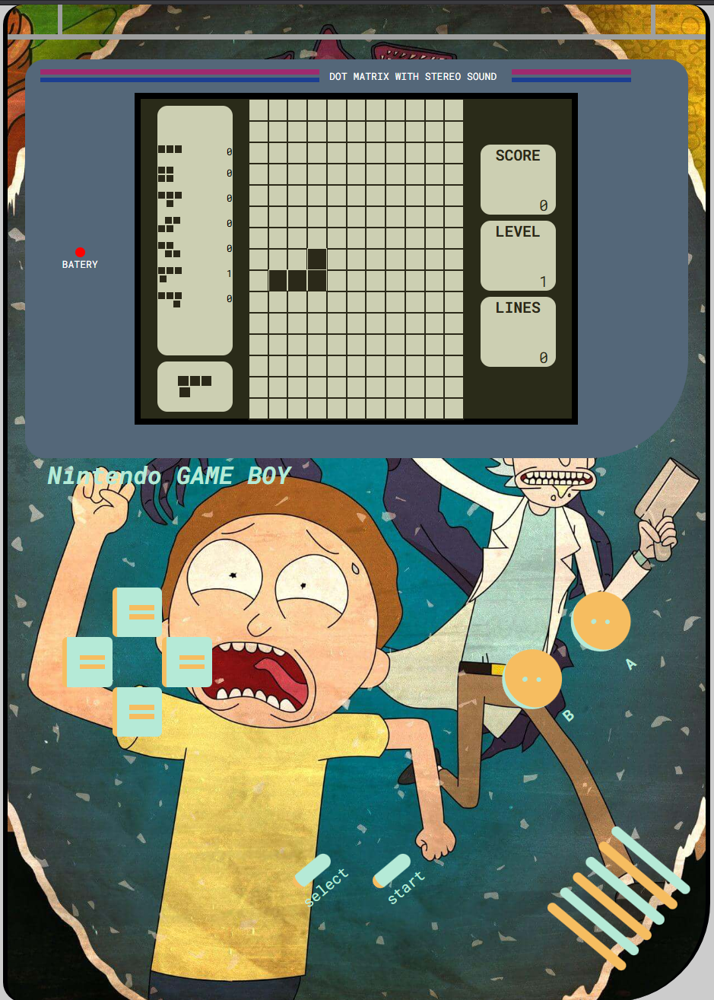

# 🕹️ Tetris Retro – Game Boy Style [](https://deepwiki.com/SKEGDEV/MGP-FRONT-TETRIS-REACT-JS)

A nostalgic throwback: this Tetris is inspired by the classic **Game Boy** console, featuring a retro aesthetic and gameplay adapted for both mobile and desktop. Built with **React.js** using `useReducer` and custom hooks to simulate the logic of a fully playable, fluid, and fun Tetris experience.

 <!-- You can change this to the real path -->

---

## 🎯 Motivation

This project was born as a personal challenge after hearing **MiduDev** mention that Tetris was part of a technical test for a $200,000/year job. I wanted to prove to myself not only that I could build it, but that I could give it a unique visual style and a UI faithful to the original.

---

## 🚀 Technologies Used

- **React JS** – for logic and component management  
- **useReducer** – for global state handling  
- **Custom Hooks** – for separating movement and rotation logic  
- **SASS** – for modular and responsive styling  
- **JavaScript** – entirely written in plain JS

---

## 🧠 State Architecture

The app uses a central `useReducer` to manage:

- The **game board** (a scalable 2D matrix depending on screen size)
- The **current piece** and its **position**
- The **next piece**
- The **score**, **level**, and **lines cleared**
- **Collision detection**

### 🧩 Custom Hooks

- `useMotion`: Handles clearing and redrawing the piece according to user input and validates collisions  
- `useRotation`: Manages the current rotation state (rotation 1, 2, 3...) of the piece

---

## 🎮 Game Logic

- **Rotation**: Uses a rotation ID that changes the piece’s pattern  
- **Collisions**: Includes left, right, and bottom boundaries for proper gameplay  
- **Next Piece**: The upcoming piece is displayed on screen  
- **Statistics**: Displays score, level, lines cleared, and count of each piece type

---

## 🕹️ Controls

### Desktop:

- Physical keyboard keys with custom event listeners

### Mobile:

- Virtual buttons styled like the original Game Boy controls (↑ ↓ ← → A B)

---

## 🖼️ Visual Design

- **Retro style**: Board drawn as a matrix with 2x2 square cells  
- Pieces feature shadows to mimic an old-screen look  
- **Responsive Design**: Fully adapted to mobile and small screens

---

## 🔧 Technical Challenges

- **Rotation and movement** were the most difficult aspects  
- Solved using modular logic and pre-validation before redrawing the piece  
- **Collisions** are handled with a boundary system that solidifies the piece upon contact

---

## 🔊 Extras

- 🎵 Original Tetris theme music  
- ⌨️ Sound effects on key press  
- 📈 Scoring system based on lines and level:
  - 1 line: 40 pts  
  - 2 lines: 100 pts  
  - 3 lines: 300 pts  
- 🔄 Progressive speed: each level increases the game speed by 10%

---

## 📦 Installation & Run

```bash
# Using npm
npm install
npm run dev

# Using yarn
yarn install
yarn dev

# Using pnpm
pnpm install
pnpm dev

